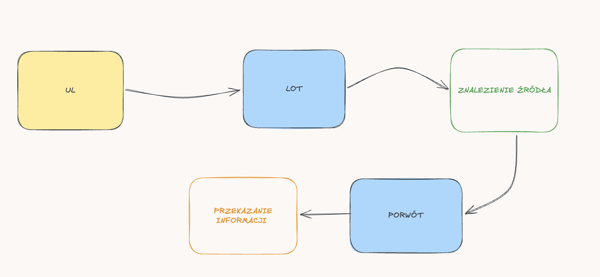
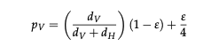
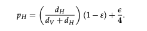

# Przegląd literatury

**Bee++- Agent-Based Simulator for Honey Bee Colonies**

Cel:&#x20;

wpływ długotrwałego narażenia na pestycydy na zdolności nawigacyjne zbiraczy, przede wszystkim w celu zilustrowania użycia Bee++.&#x20;

Kolonie pszczół → przykład systemu złożonego, gdzie globalne zachowanie roju powstaje z działań wielu pojedynczych osobnikó∑..&#x20;

Dlaczego ważne?

* pszczoły są kluczowymi zwierzętami dla zapylania roślin,
* spadek liczby pszczół stanowi problem ekologiczny,
* badanie ich zachowania w naturze jest trudne.&#x20;​

Problem badawczy:&#x20;

* jak kolonia zbiera pożywienie,
* jak pszczoły eksplorują przestrzeń,
* jak środowisko wpływa na kolonie,&#x20;
* jak zmiany klimatu lub pasożytty wpływają na pszczoły&#x20;

Czemu trudne w życiu do zrealizowania? W ulu znajdują się dziesiątki tysięcy pszczół, zachowania ich są dynamiczne oraz ŚRODOWISKO ZMIENIA SIĘ W CZASIE.

Bee++ - symualtor agentowy, tj. każda pszczoła jest agentem, posiada własny stan i zachowanie, środowisko jest modelowane przestrzennie.&#x20;

Bee++ symuluje m.in. pszczoły w ulu, pszczoły zbieraczki, kwiaty i źródła nektaru. Każdy element systemu - osobny obiekt w modelu.&#x20;

Każda pszczółka ma cechy (rola pszczoły może się zmieniać w trakcie życia):

* wiek,
* rolę w koloni,
* poziom energii,
* oraz przypsiane zadanie.&#x20;

Najważniejsze role: opieka nad lawrami (nurse bee), praca w ulu (house bee), zbieranie nektaru (foragers).&#x20;

**Środowisko - przestrzeń 2D**.&#x20;

Składa się z: ula, źródła nektaru, źródła pyłku, warunków pogodowych. Każde źródlo ma: ilość nektaru oraz lokalizacje.&#x20;
Model ruchu pszczół.&#x20;
Zbieraczki wykonują cykl:&#x20;

​

1. Poszukiwanie pożywienia - eksploracja przestrzeni wokół ula, ruch może być losowy lub ukierunkowany&#x20;
2. zbieranie nektaru - po znalezieniu kwiatka pszczoła - zbiera nektar, _**zapamiętuje lokalizację**_.
3. Powrót do ula - pszczoła wraca do ula z zasobami.
4. Po powrocie może wykonać _waggle dance - jest to taniec, który przekazuje informacje o kierunku, odległości oraz jakości źródła_. Dzięki niemu inne pszczoły również mogą polecieć w to samo miejsce.
​
Model energetyczny

Lot kosztuje energię pszczół. Jeśli dużo nektaru - kolonia rośnie, mało pożywienia - kolonia słabnie.&#x20;​

Bee++ zapisuje wiele danych:

* pozycję pszczół w przestrzeni,
* ilość zebranego nektaru,
* populację kolonii,
* zapasy jedzenia,

Dzięki temu można analizować:

* trajektorie lotów,
* efektywność zbierania pożywienia,
* wpływ środowiska.

agent = pszczoła
stan = wiek, energia, rola
decyzje = np. czy lecieć po nektar
środowisko = ul + kwiaty

Prawdodpobieństwo ruchu w pionie

gdzie:

dV = odległość pionowa do celu
dH = odległość pozioma do celu

​

Prawodpodbieństwo ruchu w poziomie

epsilon jako - błąd nawigacji pszczoły - tutaj również uwzględnienie, że pestycyty zwiększają bład (ciekawe :))&#x20;

Analiza raczej “recruits” - pszczoły lecą do znanego źródła wtedy jest ruch _biased random walk_.&#x20;

Kluczowe wnioski :

* stworzenie modelu przedstawiającego ruch pszczoły podczas poszukiwania pokarmu
* zastosowanie systemu wieloagentowego, w którym każda pszczoła jest niezależnym agentem
* określenie parametrów agenta, takich jak: pozycja, kierunek ruchu, prędkość lotu, poziom energii
* zdefiniowanie środowiska symulacji zawierającego ul, źródła pokarmu (kwiaty), ewentualne przeszkody
* opracowanie zasad ruchu pszczoły
* modelowanie procesu wykrywania źródeł pokarmu przez pszczoły (jaki promień wykrycia zapachu przez pszczołę)
* określenie zachowania pszczoły po znalezieniu pokarmu (powrót do ula, zapamiętanie lokalizacji)
* możliwość interakcji pomiędzy agentami (przekazywania informacji o znalezionych źródłach pokarmu, wymiana informacji w trakcie lotu czy już w ulu)
* analiza trajektorii ruchu pszczół oraz efektywności poszukiwania pokarmu w symulowanym środowisku
* możliwość zmiany parametrów symulacji (liczba agentów, liczba źródeł pokarmu), skalowalność modelu
* moment zakończenia symulacji (po zebraniu całego nektaru, po upływie określonego czasu)
* każdy kwiat z określoną ilością nektaru i czasem regeneracji
